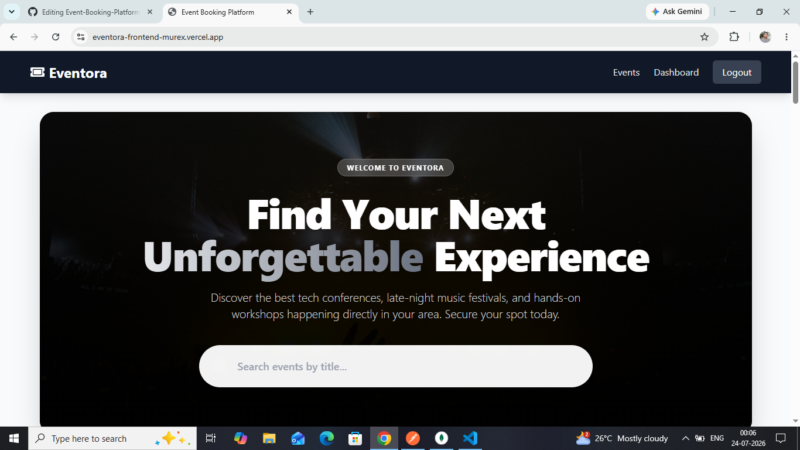
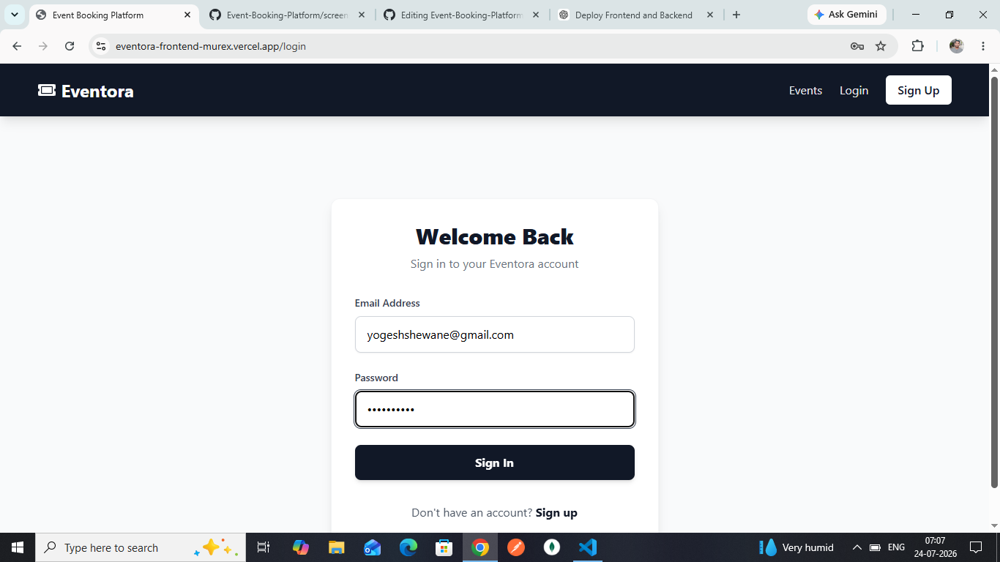
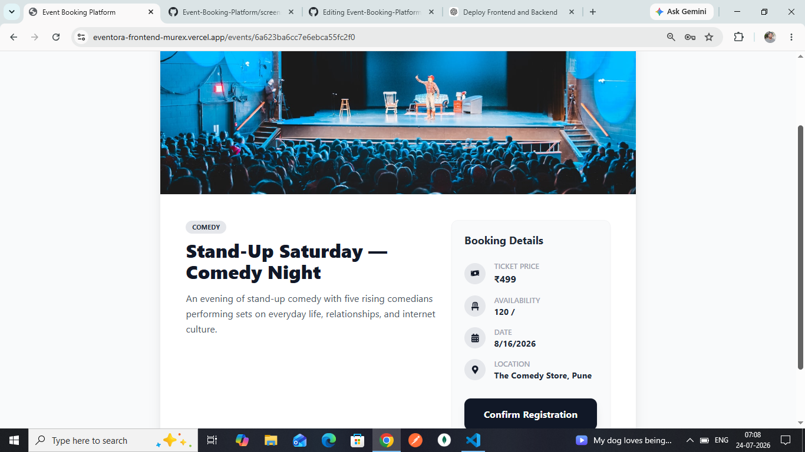
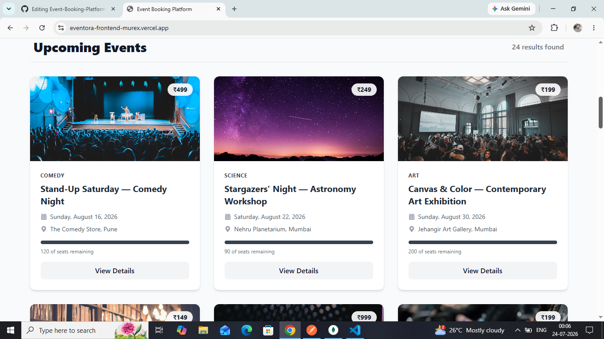
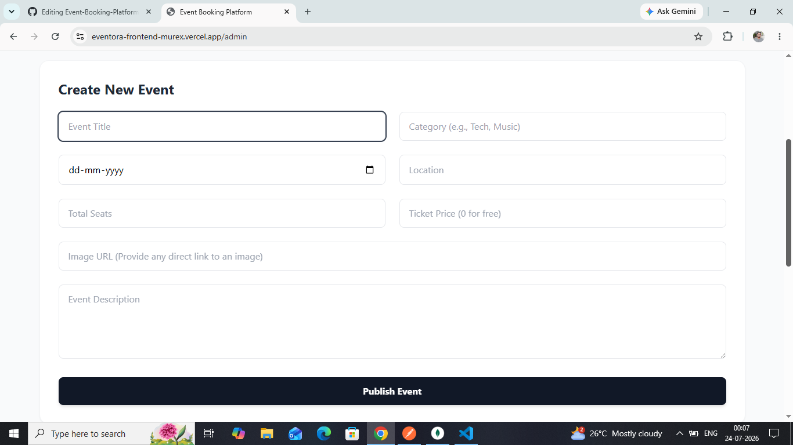
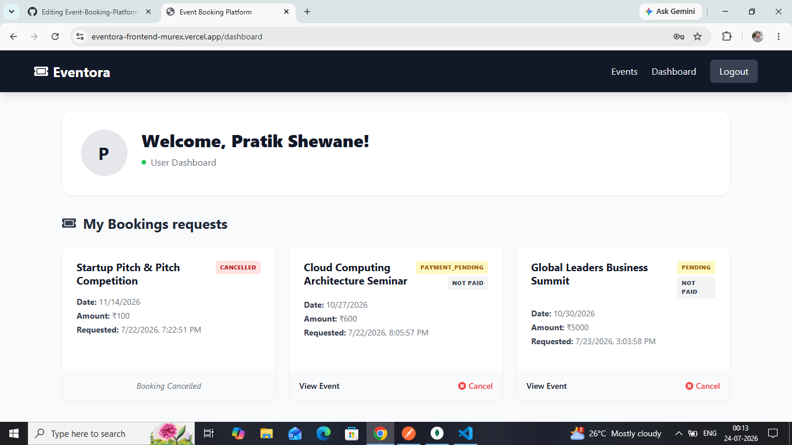
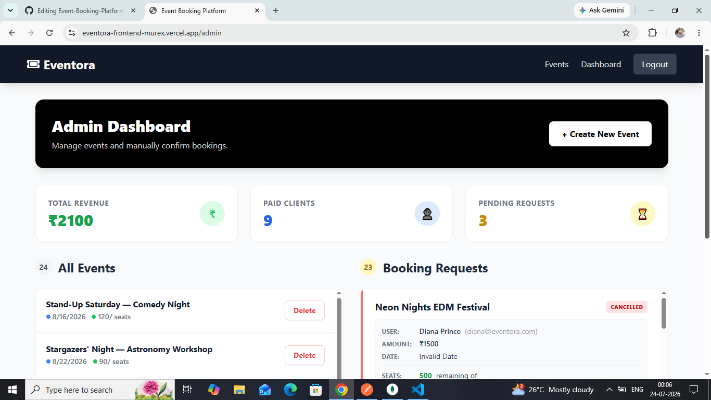
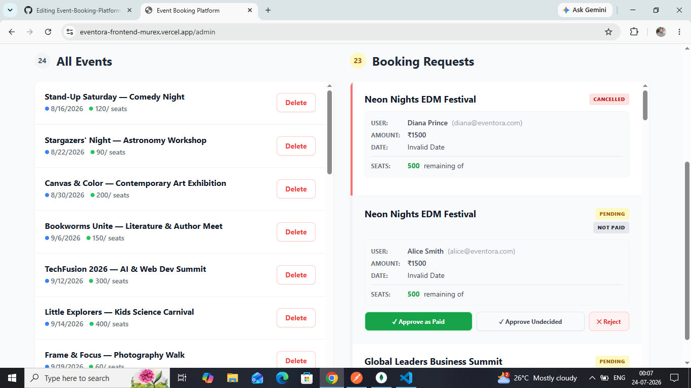

# 🎟️ Eventora - Full-Stack Event Booking Platform

Eventora is a modern full-stack **MERN Event Booking Platform** that enables users to discover, book, and manage event registrations with a secure OTP-based booking system. Unlike traditional platforms, Eventora allows organizers to manage both **free and paid events** while handling payments manually without relying on third-party payment gateways.

The platform includes a dedicated **Admin Dashboard** for event management, booking verification, revenue tracking, and analytics, along with a responsive and intuitive user experience.

---

## 🚀 Live Demo

> **Frontend:** *https://eventora-frontend-murex.vercel.app/*  
> **Backend API:** *https://eventora-backend-mjr2.onrender.com*

---
## Demo Id 

**Email:** demo@gmail.com
**Password:** Demo@123

## 📸 Screenshots

### 🏠 Home Page



---

### 🔐 Login Page




---

### 🎟️ Event Details



---

### 📅 Events Display



---

### 📅 Creating New Event



---

### 👤 User Dashboard



---

### 👨‍💼 Admin Dashboard


---

---

### 👨‍💼 Admin Panel


---
# ✨ Features

### 👤 Authentication & Security
- Secure User Registration & Login using **JWT Authentication**
- Password hashing with **bcrypt**
- Email-based **OTP Verification** for account activation
- OTP verification required before booking an event
- Protected routes with role-based authorization

---

### 🎫 Event Booking
- Browse upcoming events
- View detailed event information
- Book free and paid events
- Secure OTP verification before confirming booking
- Cancel pending bookings
- Prevents overbooking using seat availability validation

---

### 👨‍💼 Admin Dashboard
- Create, edit, and delete events
- Manage free and paid events
- Confirm or reject booking requests
- Mark bookings as **Paid** or **Not Paid**
- Dashboard analytics including:
  - Pending Bookings
  - Total Revenue
  - Confirmed Paid Users
  - Event Statistics

---

### 📧 Email Notifications
- OTP verification emails
- Booking confirmation emails
- Powered by **Nodemailer**

---

### 🎨 User Experience
- Responsive UI
- Built with Tailwind CSS
- Smooth animations and micro-interactions
- Clean and modern design

---

# 🛠️ Tech Stack

## Frontend
- React.js
- Vite
- Tailwind CSS
- React Router
- Axios

## Backend
- Node.js
- Express.js
- MongoDB
- Mongoose
- JWT Authentication
- bcrypt
- Nodemailer

---

# 📂 Project Structure

```text
Eventora/
│
├── client/
│   ├── src/
│   ├── public/
│   └── package.json
│
├── server/
│   ├── controllers/
│   ├── models/
│   ├── middleware/
│   ├── routes/
│   ├── utils/
│   └── package.json
│
├── .gitignore
└── README.md
```

---

# ⚙️ Environment Variables

Create a `.env` file inside the **backend** directory.

```env
PORT=5000

MONGO_URI=your_mongodb_connection_string

JWT_SECRET=your_jwt_secret

EMAIL_USER=your_email@gmail.com

EMAIL_PASS=your_google_app_password
```

---

# 📦 Installation

Clone the repository

```bash
git clone https://github.com/pratikShewane369/Event-Booking-Platform.git
```

Move into the project

```bash
cd Eventora
```

---

## Backend Setup

```bash
cd backend
npm install
npm run dev
```

Backend runs on

```
http://localhost:5000
```

---

## Frontend Setup

Open another terminal

```bash
cd frontend
npm install
npm run dev
```

Frontend runs on

```
http://localhost:5173
```

---

# 🔐 User Roles

## User

- Register/Login
- Verify account using Email OTP
- Browse events
- Book events
- Verify booking using OTP
- View booking history
- Cancel pending bookings

---

## Admin

- Create events
- Edit events
- Delete events
- Manage bookings
- Confirm or reject requests
- Mark bookings as Paid / Not Paid
- View analytics dashboard

---

# 📊 Key Functionalities

- JWT Authentication
- OTP-based Account Verification
- OTP-based Ticket Booking
- Role-Based Authorization
- Manual Payment Verification
- Event Capacity Validation
- Booking Management
- Admin Analytics Dashboard
- Email Notifications
- Responsive Design

---

# 🔮 Future Improvements

- Online payment integration (Stripe/Razorpay)
- QR Code-based event tickets
- PDF ticket generation
- Event search & filtering
- User profile management
- Event wishlist
- Real-time notifications
- Docker support
- CI/CD pipeline

---

# 🤝 Contributing

Contributions are welcome!

1. Fork the repository
2. Create a new branch

```bash
git checkout -b feature-name
```

3. Commit your changes

```bash
git commit -m "Added new feature"
```

4. Push to your branch

```bash
git push origin feature-name
```

5. Open a Pull Request

---

